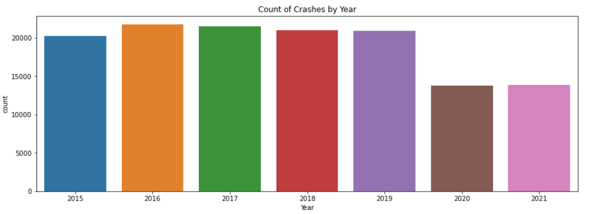

#  Project 3: Car Crash Data, Montgomery County, MD

### Table of Contents

1. [Overview](#overview)
2. [Problem Statement](#problem-statement)
3. [Dataset](#dataset)
4. [Software Requirments](#software-requirements)
5. [Analysis Summary](#analysis summary)
6. [Recommendations](#recommendations)

### Overview

From 2015 to 2019, Montgomery Country averaged approximately 21100 automobile crashes per year. For the years 2020 and 2021 (January to November), the number of car crashes is 13800. The sudden drop in crashes is undoubtedly attributable to fewer drivers on the road, because of the pandemic which emerged circa March 2020.

Montgomery County officials suspect that the average number of crashes will return to pre-pandemic levels once the county (and country) returns to normal.  In fact, despite there being fewer cars on the road, the county (and state) have noticed an [uptick in risky driving such as speeding](https://wtop.com/maryland/2020/10/concerning-uptick-in-drivers-speeds-since-pandemic-shutdown/) The nation has also noticed the [same uptick](https://www.nhtsa.gov/open-letter-driving-public) despite fewer drivers.

Montgomery County has asked us to perform a data analysis of their [car crash data](https://data.montgomerycountymd.gov/Public-Safety/Crash-Reporting-Drivers-Data/mmzv-x632) to determine if there are any factors that can be mitigated that will reduce the number of crashes and predict reckless drivers.

---

### Problem Statement

Can an analysis on Montgomery County crash data yield the following?:

> - Insights into which individual _(or combination of)_ factors contribute most to crashes?
> - Can features such as speed limit, time of day, surface condition, and time of day be used to classify whether a driver is at fault for an automobile crash? 

---

### Dataset

#### Data Used in Analysis

The following data set was used in the analysis:

* [`crash_reporting_drivers_data.csv`](./data/crash_reporting_drivers_data.csv)

Source: https://data.montgomerycountymd.gov/Public-Safety/Crash-Reporting-Drivers-Data/mmzv-x632

Source: https://catalog.data.gov/dataset/crash-reporting-drivers-data

#### Data Dictionary
|Feature|Type|Dataset|Description|
|---|---|---|---|
|**Crash Time of Day**|*string*|crash_reporting_drivers_data.csv|Time of day crash occurred|
|**Collision Type**|*string*|crash_reporting_drivers_data.csv|Type of collision|
|**Surface Condition**|*string*|crash_reporting_drivers_data.csv|Condition of roadway surface|
|**Light**|*string*|crash_reporting_drivers_data.csv|Lighting conditions|
|**Traffic Control**|*string*|crash_reporting_drivers_data.csv|Signage or traffic control devices|
|**Driver Substance Abuse**|*string*|crash_reporting_drivers_data.csv|Substance abuse detected in driver(s)|
|**Driver At Fault**|*string*|crash_reporting_drivers_data.csv|Whether this driver was at fault|
|**Driver Distracted By**|*string*|crash_reporting_drivers_data.csv|The reason the driver was distracted|
|**Vehicle First Impact Location**|*string*|crash_reporting_drivers_data.csv|Vehicle - Location of vehicle area where first impact occurred on|
|**Vehicle Second Impact Location**|*string*|crash_reporting_drivers_data.csv|Vehicle - Location of vehicle area where second impact occurred on|
|**Vehicle Body Type**|*string*|crash_reporting_drivers_data.csv|The body type of the vehicle|
|**Vehicle Movement**|*string*|crash_reporting_drivers_data.csv|The movement of the vehicle at the time of the collision|
|**Speed Limit**|*int*|crash_reporting_drivers_data.csv|Vehicle Circumstances - Local area posted speed limit|
|**Parked Vehicle**|*string*|crash_reporting_drivers_data.csv|Defines if the vehicle was parked or not at the event|

---

### Software Requirements

The software requirements for this project are expected Python data analysis packages such as `pandas`, _(for organization of the data)_, `numpy`, _(for computation of data)_ `seaborn` _(for graphing and plotting)_, and `scikit-learn` _(for building models around the data)._

---

### Analysis Summary

We built a logistic regression model that is able to determine driver fault in a crash based on basic crash facts. The model showed 89% accuracy for both training and testing with 87.5% F1 score. We saw very mild improvement in using a random forest model but lost the interpretability in terms of sign of correlation with driver fault.

Overall the features most associated with driver fault were vehicle movement, driver distraction, driver substance abuse. The movement most associated with accidents was backing up. Changing langes, passing and u-turns were also strongly correlated with driver fault. With the exception of u-turns these are very basic maneuvers that drivers do everyday.

Speed limit was negatively correlated with driver fault in accidents, indicating that driver-caused accidents are more likely in lower speed environments.

Traffic controls were associated with fault when the signs were related to warnings, railway crossings, flashing lights and school-zones. This is a particuarly troubling finding given that it means people are disregarding traffic controls.

Daylight conditions were actually the most correlated with driver fault in crashes. They are also highly prevalent in the crash data and thus should be a focus of mitigation strategies.

---

### Recommendations 

To reduce fatalities and serious injuries...
> - continue to focus on campaigns that address intoxicated and distracted driving.
> - consider supplementing alternative forms of transportation such as public transportation, taxis, and ride-sharing.

To reduce overall crashes... 

> - encourage other forms of transportation during daylight  (bus, public bikes, scooters)
> - increase controls on state highways (‘your speed’ signs, speed traps, traffic controls)
> - defensive driving PSAs highlighting the dangers of everyday maneuvers (Backing up, u-turns, lane changes, passing and entering traffic )
> - increase awareness around traffic controls and consider enforcement mechanisms

---

